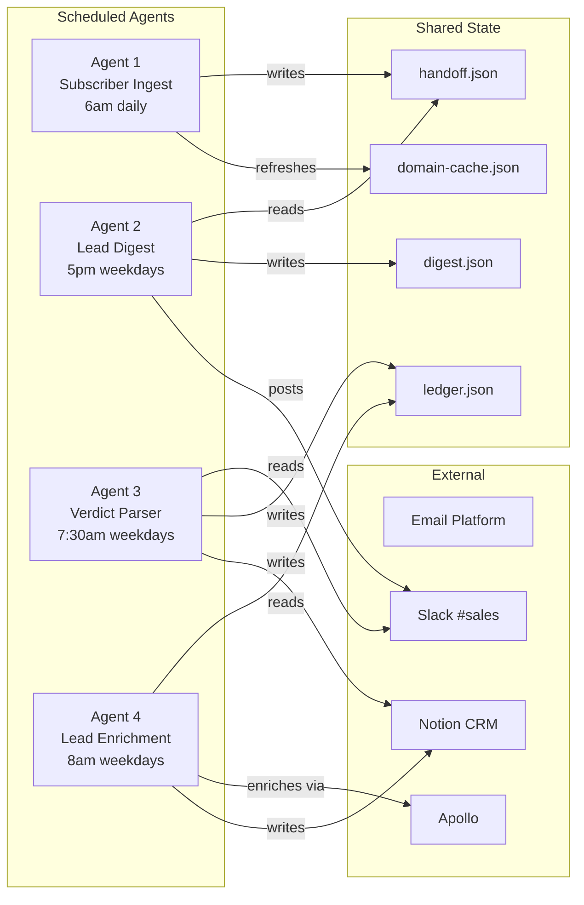
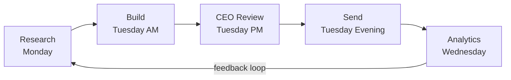
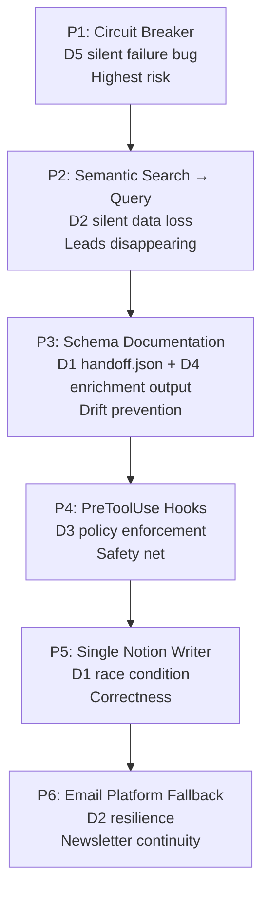
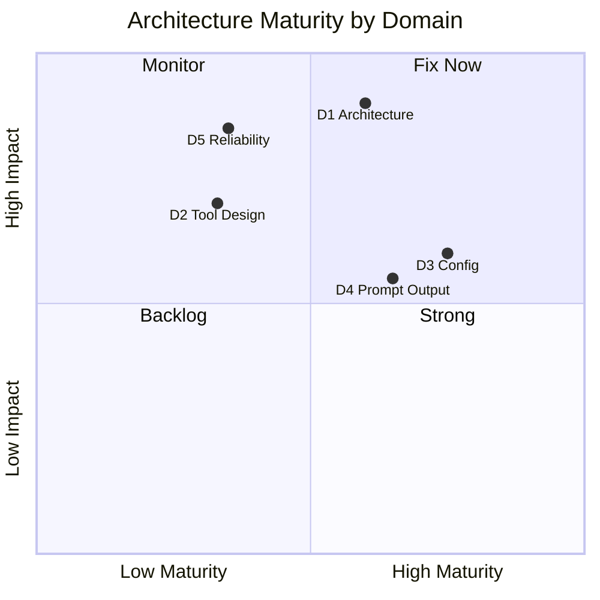

# Worked Example: CCAF Audit of Acme Analytics

This is a complete CCAF audit of a fictional company's Claude-powered system. Use it as a reference for how to apply the [audit checklist](audit-checklist.md) to a real system.

## System Overview: Acme Analytics

Acme Analytics is a 4-person B2B SaaS company that sells market intelligence data to financial firms. They use Claude to power:

- A **weekly newsletter** sent to 50K subscribers (Tuesday send)
- A **BD pipeline** that qualifies inbound leads from their subscriber list
- A **standup deck** generated Mon/Wed/Fri for the CEO
- An **MCP server** exposing 15 API endpoints as Claude tools

### Architecture Diagram

### Newsletter Pipeline

---

## D1: Agentic Architecture (27%)

### Pipeline Design

| Check | Status | Notes |
|-------|--------|-------|
| Explicit architecture pattern | PASS | Sequential pipeline with async handoff. Can name it. Can draw the DAG. |
| Async handoff via shared state | PASS | JSON files in workspace. No in-memory passing. |
| Single responsibility per agent | PASS | Agent 1 ingests, Agent 2 digests, Agent 3 parses, Agent 4 enriches. |
| Ordered stages | PASS | 1 → 2 → 3 → 4. No circular dependencies. |

### Tiered Autonomy

| Check | Status | Notes |
|-------|--------|-------|
| Actions classified by tier | PASS | Tier 1: keyword filtering, domain caching. Tier 2: lead qualification (agent recommends, human confirms via Slack). Tier 3: pricing decisions escalated to CEO. |
| Human review gate on customer-facing output | PASS | Newsletter requires CEO review before send. |
| Tier boundaries explicit in instructions | PASS | Each agent SKILL.md states its autonomy tier. |

### State Management

| Check | Status | Notes |
|-------|--------|-------|
| Shared state via files | PASS | Four JSON files: handoff, digest, ledger, domain-cache. |
| Defined schemas | FAIL | `handoff.json` has no documented schema. Agent 1 adds fields ad hoc. Agent 2 sometimes gets unexpected keys. |
| Derived state self-heals | PASS | Domain cache rebuilt from source on every Agent 1 run. |

### Red Lines

| Check | Status | Notes |
|-------|--------|-------|
| No implicit architecture | PASS | Pattern is named and documented in CLAUDE.md. |
| No circular dependencies | PASS | DAG flows one direction. |
| Single authoritative writer per file | FAIL | Both Agent 3 and Agent 4 write to Notion CRM. No clear owner. Race conditions possible if schedules overlap. |

**D1 Score: 10/13 = 77%**

**Areas to improve**:
1. Document the `handoff.json` schema in CLAUDE.md. Every field should have a type, description, and which agent writes it.
2. Designate one agent as the authoritative Notion writer. The other agent writes to a staging file; the authoritative writer syncs it.

---

## D2: Tool Design & MCP (18%)

### Tool Selection

| Check | Status | Notes |
|-------|--------|-------|
| Right tool for the job | FAIL | Lead dashboard uses `search("active leads")` instead of `query-database(filter: {status: "active"})`. Some leads silently disappear. |
| Tool discovery at session start | PASS | All agents call `search_datasets` first. |
| Pagination handled | PASS | Small datasets use limit=500. Large datasets use date filters. |

### Transport Architecture

| Check | Status | Notes |
|-------|--------|-------|
| Transport separated from logic | PASS | Business logic works whether data comes from MCP or REST API. |
| Auth boundaries documented | PASS | CLAUDE.md lists which tools need OAuth vs API key vs none. |
| Two-hop for sensitive systems | PASS | Payment processor access uses human-triggered snapshot. |

### Error Handling

| Check | Status | Notes |
|-------|--------|-------|
| Retry logic | PASS | All MCP calls retry once on 500/timeout. |
| Fallback data sources | FAIL | No fallback defined for the email platform API. If it's down during newsletter build, the agent stalls. |
| Errors surface to user | PASS | Errors posted to Slack #ops channel. |

### Red Lines

| Check | Status | Notes |
|-------|--------|-------|
| No semantic search for enumeration | FAIL | Dashboard uses semantic search. See Tool Selection above. |
| No hardcoded schemas | PASS | Tools discovered at runtime. |
| No credentials in prompts | PASS | All credentials in environment variables. |

**D2 Score: 6/9 = 67%**

**Areas to improve**:
1. **Critical**: Replace semantic search with structured database query for the lead dashboard. This is a silent data loss bug. Use the Two-Layer Read pattern (Pattern 8 in the catalog).
2. Define a fallback for the email platform API: cached subscriber data from last successful pull, with a staleness warning.

---

## D3: Claude Code Config (20%)

### Project Structure

| Check | Status | Notes |
|-------|--------|-------|
| CLAUDE.md at root | PASS | Contains team context, rules, architecture, folder structure. |
| Spec before implementation | PASS | CLAUDE.md updated before agent SKILL.md changes. |
| Clean .claude/ structure | PASS | skills/, commands/, rules/ each have clear purpose. |

### Skills, Commands, Rules

| Check | Status | Notes |
|-------|--------|-------|
| Skills for recurring tasks | PASS | Newsletter production, report generation, data analysis. |
| Commands for human-triggered workflows | PASS | /publish, /analyze, /sync-deal. |
| Path-scoped rules | PASS | marketing/** rules enforce tone, brand, data integrity. |
| No overlap | PASS | Each file type has one job. |

### Security Model

| Check | Status | Notes |
|-------|--------|-------|
| Hooks enforce policy | FAIL | No PreToolUse hooks. Agent compliance is enforced only by prompt instructions. If an agent hallucinates, nothing blocks the bad action. |
| Sensitive ops require human confirmation | PASS | All sends, publishes, and financial actions require chat confirmation. |
| Publishing has sanitization gates | PASS | /publish scans for credentials, PII, and financial data before pushing. |

### Three-Tier Access

| Check | Status | Notes |
|-------|--------|-------|
| Tier 1 (private) defined | PASS | CLAUDE.md, memory/, agent configs, deal state, MRR. |
| Tier 2 (link-shared) defined | PASS | Training decks, internal docs via private repo. |
| Tier 3 (public) defined | PASS | Marketing stats, architecture patterns (sanitized). |
| Separate commands per security model | PASS | /publish-staging and /publish-public have different gates. |

### Red Lines

| Check | Status | Notes |
|-------|--------|-------|
| CLAUDE.md not on public repo | PASS | Starter template shared, never the real file. |
| No credentials in config files | PASS | Environment variables only. |

**D3 Score: 12/14 = 86%**

**Areas to improve**:
1. Add PreToolUse hooks for critical operations. Start with: block Notion writes that contain unverified financial data, block Slack posts that reference competitor names without human confirmation. Hooks are the safety net when prompt compliance fails.

---

## D4: Prompt & Structured Output (20%)

### Prompt Design

| Check | Status | Notes |
|-------|--------|-------|
| Every agent defines inputs, outputs, constraints | PASS | Each SKILL.md has When to Use, Steps, Output, Constraints sections. |
| Structured sections | PASS | Headers, not walls of text. |
| Output schemas in CLAUDE.md | FAIL | Agent 4's enrichment output has no defined schema. It writes free-form JSON with inconsistent field names. |

### Output Quality

| Check | Status | Notes |
|-------|--------|-------|
| Quantitative rigor | PASS | Formula + calculation + sensitivity + source for every claim. |
| Data freshness disclosed | PASS | Every newsletter has a data freshness footer. |

### Delivery Format

| Check | Status | Notes |
|-------|--------|-------|
| Format matches delivery | PASS | PDF decks use fixed canvas. Dashboards use scrollable. Emails use inline CSS. |
| Billboard mode uses overrides | PASS | CSS variables overridden, not forked. |

### Red Lines

| Check | Status | Notes |
|-------|--------|-------|
| No unverified quantitative claims | PASS | [VERIFY] tag used for unsourced numbers. |
| No broken cross-references | PASS | "Full breakdown below" links verified. |

**D4 Score: 8/10 = 80%**

**Areas to improve**:
1. Define the enrichment output schema in CLAUDE.md before Agent 4's next update. Required fields: `company_name`, `domain`, `employee_count`, `industry_code`, `funding_stage`, `qualification_status`, `reject_reason_code`. All typed. All documented.

---

## D5: Context & Reliability (15%)

### Source of Truth

| Check | Status | Notes |
|-------|--------|-------|
| One source per metric | PASS | CRM is source for deals. Email platform is source for subscribers. No overlap. |
| Formula fields read, not recalculated | PASS | Notion formula fields are read only. |
| Conflict hierarchy explicit | PASS | Database > API > cached file > training data. |

### Failure Modes

| Check | Status | Notes |
|-------|--------|-------|
| No silent data loss | FAIL | No circuit breaker on Slack OAuth. If tokens expire, digest agent fails silently. Discovered after 3 weeks of missed digests. |
| Circuit breakers on external deps | FAIL | See above. No canary calls, no fallback files, no alerts via separate channel. |
| Idempotent operations | PASS | Bulk writes check for existing records before creating duplicates. |

### Disclosure and Transparency

| Check | Status | Notes |
|-------|--------|-------|
| Data freshness disclosed | PASS | Footer on every data-driven output. |
| Floor-rounded public numbers | PASS | "50K+" subscribers in marketing. Exact count in internal dashboard. |
| Disclosure boundary explicit | PASS | CLAUDE.md defines what's Tier 1/2/3. |

### Red Lines

| Check | Status | Notes |
|-------|--------|-------|
| Silent failures are bugs | FAIL | Slack OAuth failure was silent for 21 days. This is the exact anti-pattern. |
| No formula recalculation | PASS | Read only. |
| No dual maintenance | PASS | Single source per metric. |

**D5 Score: 7/10 = 70%**

**Areas to improve**:
1. **Critical**: Implement the Circuit Breaker pattern (Pattern 3 in the catalog). Every agent that calls Slack or Notion starts with a canary call. Failure triggers degraded mode: local fallback files + email alert via separate auth boundary. This is the highest-priority fix in the entire audit.

---

## Overall Score

| Domain | Score | Weight | Weighted |
|--------|-------|--------|----------|
| D1 Agentic Architecture | 77% | 27% | 208 |
| D2 Tool Design & MCP | 67% | 18% | 120 |
| D3 Claude Code Config | 86% | 20% | 171 |
| D4 Prompt & Output | 80% | 20% | 160 |
| D5 Context & Reliability | 70% | 15% | 105 |
| **Total** | | | **764/1000** |

**Result: PASS (720 threshold)**. But barely. Two critical bugs (semantic search for enumeration, no circuit breaker) would fail the system in a stricter audit.

### Priority Fix Order

### Architecture Maturity

D5 and D2 are in the "Fix Now" quadrant: low maturity, high impact. D3 and D4 are strong. D1 is solid but has two schema documentation gaps that will cause drift over time.
